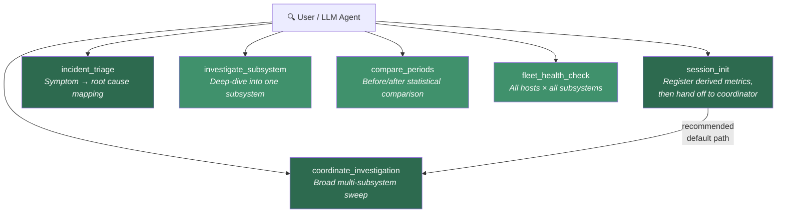
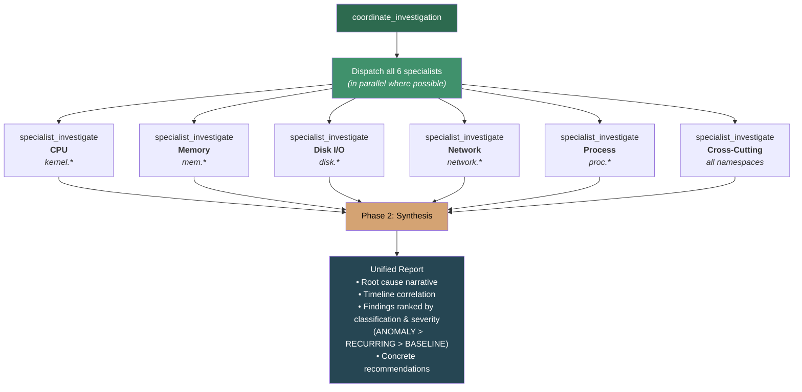
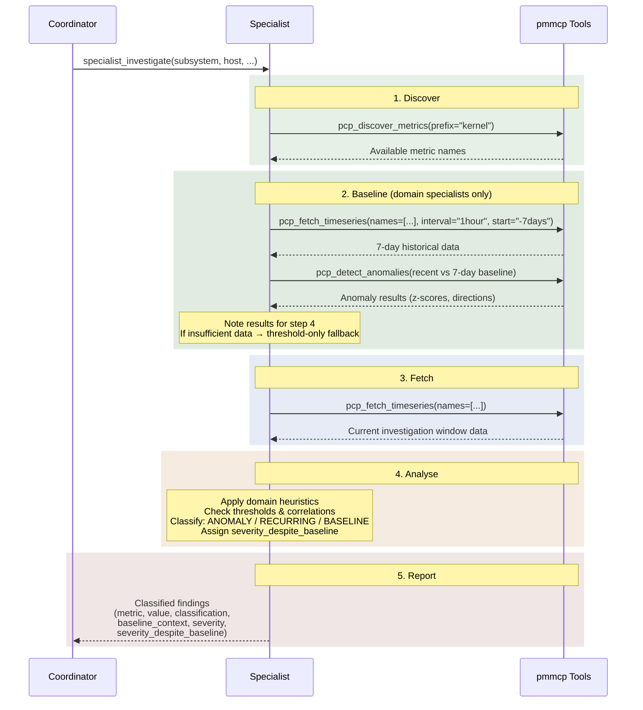

# Investigation Flow Architecture

pmmcp's investigation system uses a coordinator-specialist pattern: a single
coordinator prompt dispatches 6 domain-specialist sub-agents in parallel, each
carrying deep performance-engineering heuristics, then synthesises their findings
into a unified root-cause narrative.

## Entry Points

Five prompt templates serve as entry points, organised into two tiers.

**Orchestration tier** prompts coordinate multiple specialists and synthesise
results — they are the recommended starting points for broad investigations.

**Specialist tier** prompts target a specific subsystem or comparison and can be
invoked directly by the user for focused work, or dispatched automatically by the
orchestration tier.

### Orchestration Tier

| Prompt | When to use |
|--------|------------|
| **`session_init`** | Start of any investigation session — registers derived metrics, then hands off to `coordinate_investigation` |
| **`coordinate_investigation`** | "Something is wrong and I don't know where" — the broad sweep |
| **`incident_triage`** | You have a symptom ("app is slow") and need to map it to subsystems |

### Specialist Tier

These can be used standalone for focused work, or are dispatched by the
orchestration tier as part of a broader investigation.

| Prompt | When to use |
|--------|------------|
| **`investigate_subsystem`** | You already know the subsystem (e.g., "disk is slow") |
| **`compare_periods`** | You have two time windows and want to quantify what changed |
| **`fleet_health_check`** | Routine health check across all hosts |

## Coordinator Dispatch

`coordinate_investigation` is the orchestration hub. It dispatches all 6
specialist sub-agents in parallel, then synthesises their reports into a single
root-cause narrative with cross-subsystem correlation.

> **Parallel execution is mandated** by the coordinator prompt. LLM environments
> that cannot run sub-agents concurrently will fall back to sequential dispatch
> (CPU → Memory → Disk → Network → Process → Cross-cutting), but the prompt
> instructs the model to prefer parallel.

### The 6 Specialist Domains

Each specialist carries domain-specific heuristics — concrete thresholds, metric
relationships, and interpretation rules from experienced performance engineers.

| Specialist | Metric prefix | Focus |
|-----------|--------------|-------|
| **CPU** | `kernel.*` | Idle/user/sys/wait/steal decomposition, load vs ncpu, runqueue depth, per-CPU imbalance |
| **Memory** | `mem.*` | Available vs used, swap activity, OOM kills, page faults, slab growth, leak detection |
| **Disk I/O** | `disk.*` | Device saturation, IOPS vs device limits, queue depth, latency, read/write ratio |
| **Network** | `network.*` | Bandwidth vs link speed, drops/errors, TCP retransmits, connection states, per-interface |
| **Process** | `proc.*` | Process count, zombies, context switches, runqueue, blocked processes, thread leaks |
| **Cross-Cutting** | _(all)_ | Uses `pcp_quick_investigate` for anomaly scan, then correlates across subsystems |

## Specialist Workflow

Domain specialists (CPU, Memory, Disk, Network, Process) follow a 5-step
discipline: discover what metrics exist, establish a 7-day baseline for anomaly
detection, fetch current data, analyse against domain heuristics with baseline
context, then report structured and classified findings.

The **cross-cutting** specialist does NOT include a Baseline step — it consumes
classifications from the domain specialists rather than baselining independently.

## Synthesis Phase

After all specialists report (or fail — partial results are expected), the
coordinator synthesises findings:

1. **Cross-reference** — correlate findings across subsystems (e.g., CPU iowait +
   disk saturation → disk is the root cause)
2. **Timeline correlation** — the subsystem that changed first is the likely root
   cause
3. **Unified narrative** — tell the story of what happened, not just list findings
4. **Rank by classification, then severity** — ANOMALY findings rank above
   RECURRING, which rank above BASELINE (severity is secondary sort within each
   tier). What changed is more actionable than what has always been wrong.
5. **Call out normal behaviour** — explicitly identify chronic baseline conditions
6. **Highlight recurring patterns** — flag when an apparent anomaly matches a known
   recurring pattern (e.g., daily backup window)
7. **Recommend actions** — concrete next steps, not "investigate further"

The output follows a structured format: executive summary → root cause analysis →
findings by classification & severity (New Anomalies → Recurring Patterns →
Baseline Behaviour → Normal Operation) → recommendations → specialist status.
