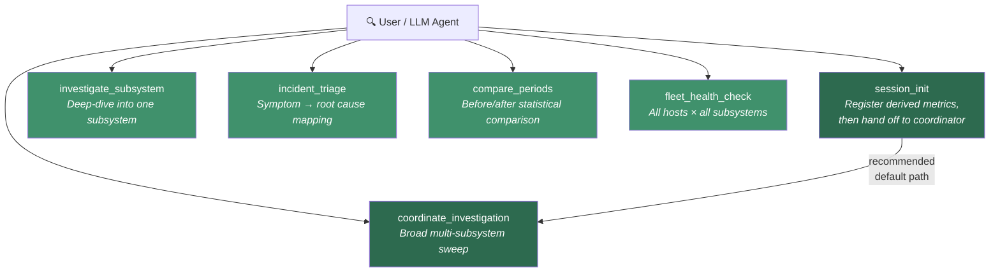
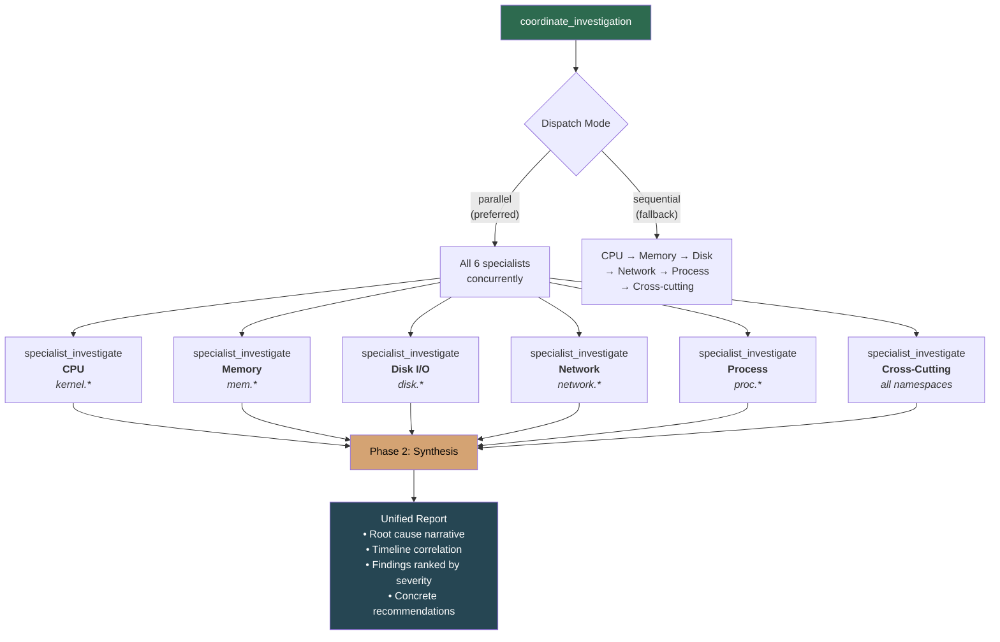
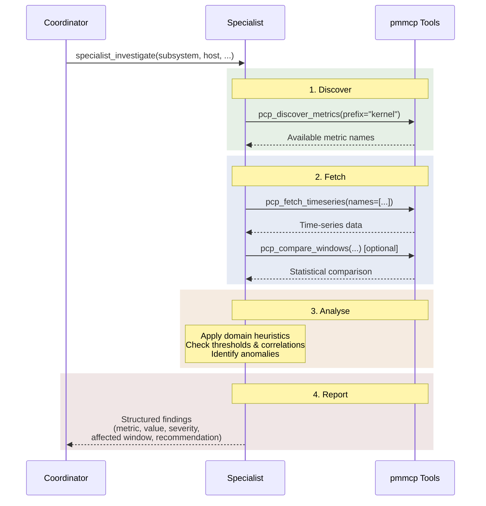

# Investigation Flow Architecture

pmmcp's investigation system uses a coordinator-specialist pattern: a single
coordinator prompt dispatches 6 domain-specialist sub-agents in parallel, each
carrying deep performance-engineering heuristics, then synthesises their findings
into a unified root-cause narrative.

## Entry Points

Five prompt templates serve as entry points. For a general "something is wrong"
investigation, `coordinate_investigation` (via `session_init`) is the recommended
default. The others target specific scenarios where you already know what you're
looking at.

| Prompt | When to use |
|--------|------------|
| **`session_init`** | Start of any investigation session — registers derived metrics, then points to `coordinate_investigation` |
| **`coordinate_investigation`** | "Something is wrong and I don't know where" — the broad sweep |
| **`investigate_subsystem`** | You already know the subsystem (e.g., "disk is slow") |
| **`incident_triage`** | You have a symptom ("app is slow") and need to map it to subsystems |
| **`compare_periods`** | You have two time windows and want to quantify what changed |
| **`fleet_health_check`** | Routine health check across all hosts |

## Coordinator Dispatch

`coordinate_investigation` is the orchestration hub. It dispatches all 6
specialist sub-agents — preferring parallel execution — then synthesises their
reports into a single root-cause narrative with cross-subsystem correlation.

### The 6 Specialist Domains

Each specialist carries domain-specific heuristics — concrete thresholds, metric
relationships, and interpretation rules from experienced performance engineers.

| Specialist | Metric prefix | Focus |
|-----------|--------------|-------|
| **CPU** | `kernel.*` | Idle/user/sys/wait/steal decomposition, load vs ncpu, runqueue depth, per-CPU imbalance |
| **Memory** | `mem.*` | Available vs used, swap activity, OOM kills, page faults, slab growth, leak detection |
| **Disk I/O** | `disk.*` | Device saturation, IOPS vs device limits, queue depth, latency, read/write ratio |
| **Network** | `network.*` | Bandwidth vs link speed, drops/errors, TCP retransmits, connection states, per-interface |
| **Process** | `proc.*` | Process count, zombies, context switches, runqueue, blocked processes, thread leaks |
| **Cross-Cutting** | _(all)_ | Uses `pcp_quick_investigate` for anomaly scan, then correlates across subsystems |

## Specialist Workflow

Every specialist follows the same 4-step discipline: discover what metrics exist,
fetch the data, analyse against domain heuristics, then report structured findings.
This prevents the common failure mode of querying metrics that don't exist on the
target host.

## Synthesis Phase

After all specialists report (or fail — partial results are expected), the
coordinator synthesises findings:

1. **Cross-reference** — correlate findings across subsystems (e.g., CPU iowait +
   disk saturation → disk is the root cause)
2. **Timeline correlation** — the subsystem that changed first is the likely root
   cause
3. **Unified narrative** — tell the story of what happened, not just list findings
4. **Rank by impact** — order by severity and blast radius
5. **Recommend actions** — concrete next steps, not "investigate further"

The output follows a structured format: executive summary → root cause analysis →
findings by severity → recommendations → specialist status.
